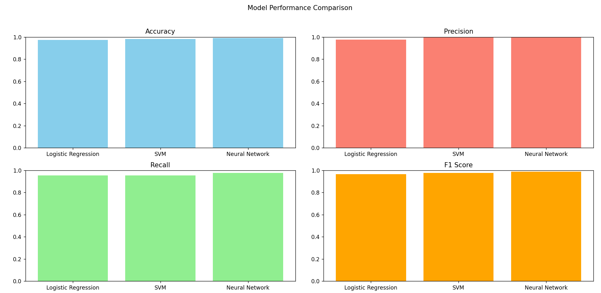

# Breast Cancer Classification using Feed-Forward Neural Network

**This project applies a feed-forward neural network, along with Logistic Regression and SVM models, to classify breast cancer as benign or malignant based on a dataset from Kaggle. It serves as an introduction to GitHub, Python, and machine learning model implementation.**

**Project Structure**

```plaintext
breast_cancer_classification/
├── README.md
├── requirements.txt
├── data/
│   └── breast_cancer_data.csv  # Dataset file (downloaded from Kaggle)
├── src/
│   ├── preprocess.py           # Data loading and preprocessing functions
│   ├── models.py               # Model definitions (logistic regression, feed-forward NN, SVM)
│   ├── train.py                # Training and evaluation script
│   └── utils.py                # Utility functions for evaluation and other tasks
└── notebooks/
    └── Breast_Cancer_Classification.ipynb  # Jupyter notebook for running test cases


``` 

## **Dataset**

The dataset, available on [Kaggle](https://www.kaggle.com/code/fareselmenshawii/breast-cancer-various-models), contains features such as **radius**, **texture**, **perimeter**, and **area** to predict whether a tumor is malignant or benign. Place the downloaded `breast_cancer_data.csv` file in the `data/` folder.

## **Feature Descriptions**

The dataset includes various features representing different characteristics of cell nuclei, which are used to predict whether a tumor is benign or malignant. Here’s a summary of the features:

- **ID**: Unique identifier for each sample
- **Diagnosis**: Target variable indicating whether the tumor is benign (B) or malignant (M)
- **Mean Measurements**: Average measurements for each cell nucleus feature:
  - `radius_mean`, `texture_mean`, `perimeter_mean`, `area_mean`
  - `smoothness_mean`, `compactness_mean`, `concavity_mean`, `concave points_mean`
  - `symmetry_mean`, `fractal_dimension_mean`
- **Worst Measurements**: Largest measurements for each cell nucleus feature:
  - `radius_worst`, `texture_worst`, `perimeter_worst`, `area_worst`
  - `smoothness_worst`, `compactness_worst`, `concavity_worst`, `concave points_worst`
  - `symmetry_worst`, `fractal_dimension_worst`

Each feature provides valuable information to help classify tumors based on nuclear features. For a complete list, refer to the dataset on [Kaggle](https://www.kaggle.com/code/fareselmenshawii/breast-cancer-various-models).

### **Target Variable**

Diagnosis: Binary classification (0 = Benign, 1 = Malignant)


---

## **Performance Comparison**

After training the Logistic Regression, SVM, and Feed-Forward Neural Network models, the notebook compares their performance using accuracy, precision, recall, and F1 score. A bar chart displays each model’s performance for easier comparison.

The bar chart below shows the performance metrics (Accuracy, Precision, Recall, and F1 Score) for Logistic Regression, SVM, and Neural Network models:




## **Installation**

### **Clone the repository:**

```bash
git clone https://github.com/stefsamaha/breast_cancer_classification.git
cd breast_cancer_classification

### **Install Dependencies**

pip install -r requirements.txt
